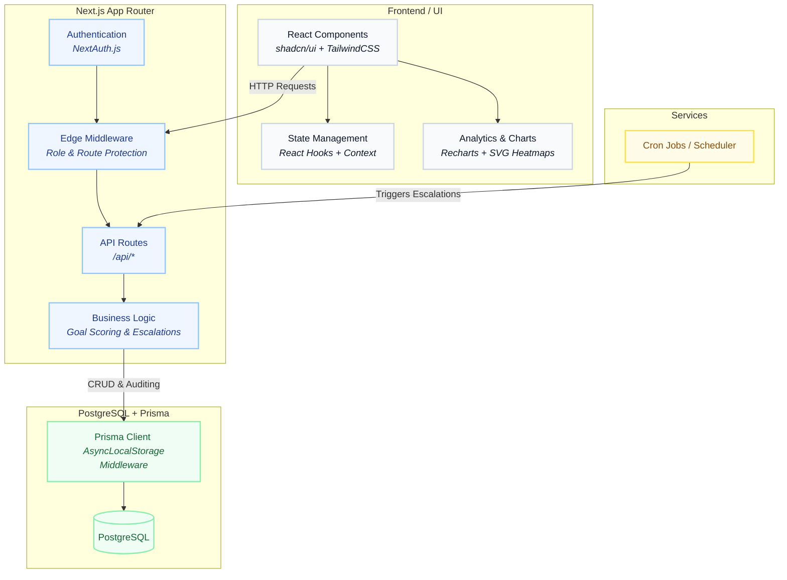

# Meridian: Enterprise Goal Governance Platform

**Meridian** is a next-generation performance management engine designed to enforce organizational alignment, transparency, and accountability.
1. **Strategic Alignment:** Maps individual employee objectives to top-level company thrust areas through automated, time-boxed quarterly check-in cycles.
2. **Immutable Governance:** Enforces strict role-based approval workflows and intercepts all post-lock modifications via a tamper-proof Prisma audit ledger.
3. **Executive Visibility:** Delivers real-time insights through a high-density analytics engine featuring completion heatmaps and quarter-over-quarter trend analysis.

---

## 🔑 Default Login Credentials

Use the following credentials to explore the different role-based features of the application. These accounts are created automatically when you seed the database.

| Role | Email | Password | What they can do |
| :--- | :--- | :--- | :--- |
| **Admin** | `admin@meridian.in` | `Admin@1234` | Create Cycles, Manage Thrust Areas, System Audit Logs, Grant Exemptions |
| **Manager** | `manager@meridian.in` | `Manager@1234` | Approve/Return team goals, conduct team check-ins, view Analytics & Reports |
| **Employee** | `emp1@meridian.in` | `Employee@1234` | Draft goals, submit check-ins, track personal quarterly progress |

---

## 🚀 How To Use The Platform (Step-by-Step)

To experience the full lifecycle of the platform, follow this workflow:

1. **Setup the Organization (As Admin)**
   - Log in as **Admin**.
   - Navigate to **Thrust Areas** and create strategic company pillars (e.g., "Customer Excellence", "Revenue Growth").
   - Navigate to **Cycles** and create a new Performance Cycle (e.g., "FY 2026") setting the open dates for Goal Setting and all 4 quarters. **Click "Activate"** to make this the active cycle.

2. **Draft & Submit Goals (As Employee)**
   - Log in as **Employee** (`emp1@meridian.in`).
   - Navigate to **My Goals**. Click "+ Add Goal" to draft a new goal.
   - Fill in the details (Title, Target Value, Unit of Measurement, Weightage, and link it to a Thrust Area).
   - Once all goals sum to a 100% weightage, click **Submit for Approval**.

3. **Approve Goals (As Manager)**
   - Log in as **Manager**.
   - Navigate to **Team Goals**. You will see the Employee's submitted goals.
   - Review the goals and click **Approve** (this locks the goals). 

4. **Log Achievements (As Employee)**
   - Log in as **Employee**.
   - Navigate to **My Check-ins**. 
   - During an open quarter (e.g., Q1), enter your `Actual Value` achieved and any notes. Click **Save Achievement**. The system will automatically compute your normalized performance score (0-100%).

5. **Review Analytics & Audits (As Manager or Admin)**
   - Log in as **Admin** or **Manager**.
   - Navigate to **Analytics** to view Quarter-over-Quarter performance trends and Goal Distributions via interactive charts.
   - Navigate to **Completion Report** to view a high-density Heatmap of which employees have completed their check-ins.
   - Navigate to **Audit Log** (Admin only) to see the immutable ledger. Because the Employee's goals were locked, any subsequent edits by the Manager or Admin are permanently recorded here with strict diffs.

---

## ✨ Comprehensive Feature List

Meridian is broken down into five major feature domains, all fully implemented and ready for production.

### 1. Goal Setting & Planning Engine
- **Strategic Alignment:** Goals must be tied to organizational `Thrust Areas` ensuring top-down strategic alignment.
- **Flexible Measurement:** Support for multiple units of measurement (UoM) including `MIN_NUMERIC` (aiming for at least X), `MAX_NUMERIC` (staying under X limit), and `TIMELINE` goals.
- **Smart Validation:** Prevents submission until the total combined goal weightage equals exactly 100%.
- **Goal Cascading (Shared Goals):** Managers can take top-level organizational goals and cascade them down to specific employees with custom weightages.

### 2. Quarterly Check-in System
- **Time-Boxed Cycles:** Goal setting and quarterly check-ins (Q1, Q2, Q3, Q4) are strictly controlled by open/close dates configured by Admins.
- **Automated Scoring Algorithm:** Evaluates actual performance against target values using linear normalization. Results are intelligently bounded between 0% and 100%.
- **Progress Tracking:** Goals are color-coded based on status (`NOT_STARTED`, `ON_TRACK`, `COMPLETED`).

### 3. Role-Based Governance
- **Manager Approval Workflow:** Managers have a dedicated portal to bulk-approve, edit, or return draft goals with comments.
- **Performance Exemptions:** Admins can grant official exceptions (e.g., Medical Leave, Sabbatical) for specific quarters or entire cycles. This automatically adjusts the employee's weighted scoring average so they aren't penalized.

### 4. Advanced Auditability (The Immutable Ledger)
- **Post-Lock Diff Tracking:** Once a goal is approved (locked), any subsequent modifications (e.g., changing a target date or value) are intercepted by Prisma ORM Middleware using `AsyncLocalStorage`.
- **System Audit Trail:** Changes are logged to an immutable ledger showing exactly Who made the change, What the old/new values were, When it happened, and Why (Reason text).

### 5. High-Density Reporting & Analytics
- **Achievement Report:** A granular, searchable data table displaying raw scores, target metrics, and exact completion statuses for all goals across the organization.
- **Completion Heatmap:** A visual density grid allowing executives to see check-in velocity and bottlenecks across teams at a glance.
- **Executive Analytics Dashboard:**
  - **QoQ Trend Chart:** Multi-line Recharts graph visualizing the trajectory of average goal achievement scores over the four quarters.
  - **Goal Distributions:** Donut and bar charts providing breakdowns of goals by Thrust Area and current Status.

### 6. Automated Escalation & Notification Engine (Phase 5)
- **Multi-Level Escalations:** Automatically flags overdue check-ins and routes reminders through a three-tier chain (Level 1: Employee, Level 2: Skip-level Manager, Level 3: HR Escalation).
- **Multichannel Notifications:** Custom messaging service supporting branded, mobile-responsive HTML emails and rich Microsoft Teams Adaptive Cards.
- **Admin Controls:** Comprehensive rule builder to modify notification threshold days and a system-wide log to audit notification statuses (Sent, Pending, Failed) with manual resend overrides.

---

## 🏗 System Architecture

The application is built on a full-stack Next.js architecture using the App Router, integrating a robust PostgreSQL database via Prisma ORM for type-safe data access.



## 🛠 Getting Started

1. **Install dependencies:**
   ```bash
   npm install
   ```

2. **Set up the database:**
   Ensure you have a PostgreSQL instance running. Configure the `DATABASE_URL` in your `.env` file.
   ```bash
   npx prisma db push
   npx prisma generate
   ```

3. **Seed the database (Required for initial accounts):**
   ```bash
   npm run db:seed
   ```

4. **Run the development server:**
   ```bash
   npm run dev
   ```

The application will be available at `http://localhost:3000`.